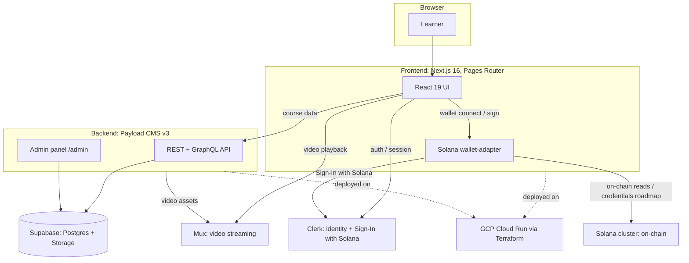

# Melearn

> A Solana-hackathon e-learning platform for Blockchain, Web3, and career courses — with wallet sign-in today and on-chain credentials on the roadmap.

[](./LICENSE)
[](https://github.com/natthawat141/melearn-starter/actions/workflows/ci.yml)

Melearn is a monorepo: a Next.js frontend, a Payload CMS backend, and Terraform
infrastructure for Google Cloud. Learners sign in with email or a Solana wallet
(Sign-In with Solana via Clerk), browse courses managed in the CMS, and watch
video lessons served through Mux. Course-completion credentials issued on-chain
are planned (see [Roadmap](#roadmap)).

---

## Architecture



A more detailed deployment-side diagram (Cloud Run services, the migration Job,
Secret Manager, and WIF CI/CD) lives in [`infra/README.md`](./infra/README.md).

---

## Monorepo layout

```
melearn/
├── frontend/          Next.js 16 (Pages Router) — learner-facing app
│   ├── src/
│   │   ├── components/ layout + page sections
│   │   ├── hooks/      wallet + Clerk↔Solana sync
│   │   ├── lib/        Supabase client
│   │   └── pages/      routes (index, courses, sign-in, sign-up, user, ...)
│   └── README.md       → frontend setup & details
├── backend/           Payload CMS v3 on Supabase Postgres (port 3001)
│   ├── src/
│   │   ├── collections/  users, media, categories, instructors, courses, partners
│   │   └── migrations/   committed schema migrations (applied as a separate job)
│   └── README.md       → backend setup, DB, migrations, API
├── infra/             Terraform + GCP (Cloud Run, migration Job, WIF CI/CD)
│   └── README.md       → infrastructure & deployment
└── .github/           CI/CD workflows, issue & PR templates
```

---

## Tech stack

| Layer | Technology |
|-------|-----------|
| Frontend | Next.js 16 (Pages Router), React 19, TypeScript |
| UI | Tailwind CSS 3, Framer Motion, AOS, react-icons |
| Identity | Clerk (`@clerk/nextjs`), incl. Sign-In with Solana |
| Wallet / Web3 | `@solana/wallet-adapter-*`, `@solana/web3.js` |
| Data (frontend) | Supabase (`@supabase/supabase-js`) — Postgres + Storage |
| Video | Mux |
| Backend / CMS | Payload CMS v3 on Next.js (App Router), React 19 |
| Database | Supabase Postgres (`@payloadcms/db-postgres`) |
| Rich text / media | `@payloadcms/richtext-lexical`, `sharp` |
| Infrastructure | Google Cloud Run, Terraform, Artifact Registry, Secret Manager |
| CI/CD | GitHub Actions with Workload Identity Federation (keyless) |
| Testing | Vitest, React Testing Library, Playwright |

---

## Quickstart

### Prerequisites

- **Node 22** — `nvm install 22 && nvm use 22`
- npm (bundled with Node)
- Accounts/keys for [Clerk](https://dashboard.clerk.com),
  [Supabase](https://supabase.com/dashboard), and [Mux](https://dashboard.mux.com)
  when wiring real services. Each package's `.env.example` documents what is needed.

### 1. Configure environment

Each package has its own `.env.example`. Copy it and fill in values — never commit
the resulting files (all `.env*` files are gitignored).

```bash
# Frontend
cd frontend
cp .env.example .env.local      # Clerk, Supabase, Solana cluster, Mux

# Backend
cd ../backend
cp .env.example .env            # Supabase DATABASE_URL, PAYLOAD_SECRET, etc.
```

See the per-package references for what each variable means:

- Frontend env: [`frontend/.env.example`](./frontend/.env.example) and [`frontend/README.md`](./frontend/README.md)
- Backend env: [`backend/.env.example`](./backend/.env.example) and [`backend/README.md`](./backend/README.md)
- Infra secrets: [`infra/README.md`](./infra/README.md)

### 2. Install and run

Run the two services in separate terminals.

```bash
# Frontend → http://localhost:3000
cd frontend
npm install
npm run dev
```

```bash
# Backend → http://localhost:3001 (admin at http://localhost:3001/admin)
cd backend
nvm use 22
npm install
npm run dev
```

> **Port note:** both Next.js dev servers default to port 3000. The backend's
> `dev` script pins itself to **3001** (`next dev -p 3001`) so the frontend (3000)
> and backend (3001) can run side by side. On first visit to `/admin`, Payload
> prompts you to create the initial admin user.

---

## Testing

**Frontend** (Vitest + React Testing Library for unit/component, Playwright for E2E):

```bash
cd frontend
npm test          # Vitest unit/component tests
npm run test:e2e  # Playwright end-to-end tests
```

**Backend** (Vitest for unit/contract/integration, Playwright for E2E):

```bash
cd backend
npm run test:unit   # Vitest unit + contract tests
npm run test:int    # Vitest integration tests
npm run test:e2e    # Playwright E2E
npm test            # unit + e2e
```

---

## Deployment

Melearn deploys to **Google Cloud Run** with infrastructure managed by **Terraform**
and keyless CI/CD via **GitHub Actions + Workload Identity Federation**.

Database schema changes are **not** applied on app boot. A dedicated **Cloud Run
Job** runs `payload migrate` once per deploy (using a prepared-statement-capable
connection), then the services roll out. This avoids multiple scaled-out instances
racing to mutate the schema.

Full details — modules, environments (`dev`/`prod`), the migration architecture,
secret handling, and the CD sequence — are in [`infra/README.md`](./infra/README.md).

---

## Roadmap

- [x] Landing site, course catalogue, and wallet connect
- [x] Clerk identity with Sign-In with Solana
- [x] Payload CMS backend on Supabase Postgres with committed migrations
- [ ] Mux-powered video lessons end to end
- [ ] Course progress tracking and learner profiles
- [ ] **On-chain credentials** — verifiable course-completion certificates on Solana
- [ ] Partner institution co-signatures on credentials

---

## Contributing

Contributions are welcome. Please read [`CONTRIBUTING.md`](./CONTRIBUTING.md) for
dev setup, branch/commit conventions, and the PR process, and abide by our
[Code of Conduct](./CODE_OF_CONDUCT.md). Security issues should follow the
[Security Policy](./SECURITY.md) — please do not open public issues for vulnerabilities.

---

## License

Released under the [Apache License 2.0](./LICENSE), © 2026 Bill Natthawat.
