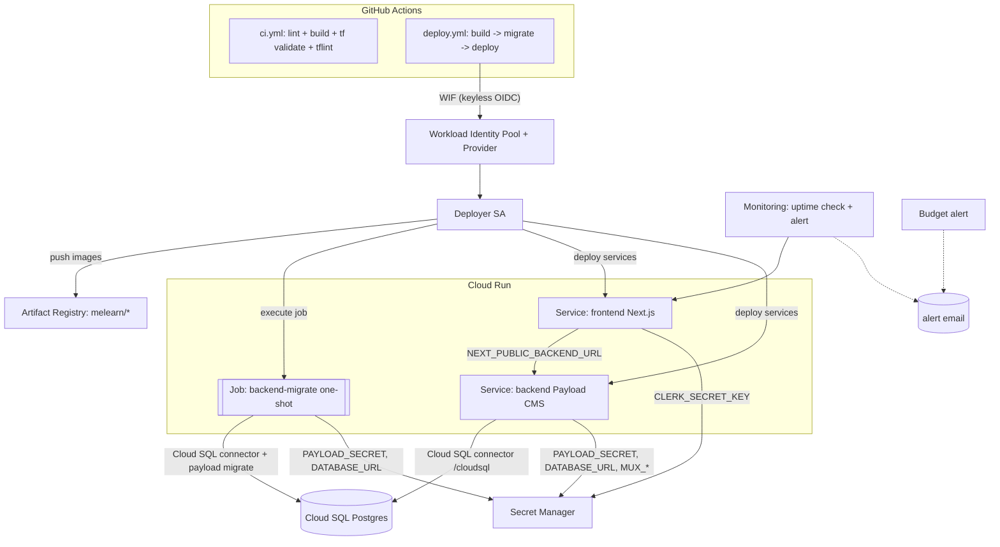

# Melearn — Infrastructure (Terraform + GCP)

Enterprise-grade infrastructure for the Melearn platform on Google Cloud:
Cloud Run services (frontend + backend), a **separate Cloud Run Job for DB
migrations**, Cloud SQL for PostgreSQL, Artifact Registry, Secret Manager,
least-privilege IAM, observability (uptime + alerts + budget), and keyless
GitHub Actions deploys via Workload Identity Federation (WIF).

---

## Architecture



ASCII fallback:

```
GitHub Actions --WIF--> Deployer SA --> { Artifact Registry, Cloud Run (FE/BE/Job), Cloud SQL }
Cloud Run FE/BE/Job --> Cloud SQL (via /cloudsql connector)
Cloud Run FE/BE/Job --> Secret Manager (least-privilege, per-secret)
Monitoring (uptime+alert) + Budget alert --> alert email
```

### Backend admin access (prod)

In **prod**, `backend_allow_public_access` defaults to **`false`** so the Payload
admin panel is NOT world-open. The backend service is only invokable by callers
with the `roles/run.invoker` IAM permission (e.g. the frontend SA, which the
frontend uses for server-to-server calls).

If you need to reach the Payload admin UI from a browser in prod, do **not** flip
`backend_allow_public_access` to `true` and expose it directly. Instead, front the
backend service with **Identity-Aware Proxy (IAP)** or another authenticating
reverse proxy / load balancer, and grant access only to specific Google identities.
Setting `backend_allow_public_access = true` makes the admin URL reachable by
anyone on the internet (auth still applies, but the surface is fully exposed).

In **dev**, public access remains `true` for convenience.

---

## Layout

```
infra/terraform/
  modules/
    artifact-registry/   Docker repo + cleanup policies
    iam/                 per-service runtime SA (+ optional cloudsql.client)
    secret/              one Secret Manager secret + per-secret accessor binding
    cloud-run/           reusable Cloud Run v2 SERVICE (+ Cloud SQL volume)
    cloud-run-job/       reusable Cloud Run v2 JOB (migrations)
    cloud-sql/           Postgres instance + database + user
    wif/                 Workload Identity Federation + deployer SA
    monitoring/          notification channel + uptime check + alert + budget
  envs/
    dev/                 dev wiring (db-f1-micro, scale-to-zero)
    prod/                prod wiring (regional HA DB, deletion protection, PITR)
```

### Environment strategy — **directory per environment**

We use `envs/dev` and `envs/prod` (separate root modules, separate state
prefixes) rather than Terraform workspaces. Rationale: distinct providers,
distinct project IDs, distinct budgets/tiers, and the ability to plan/apply one
env without risking the other. Each env has its own GCS state prefix
(`melearn/dev`, `melearn/prod`).

---

## Migration architecture (READ THIS)

SQLite is file-based and cannot be shared across horizontally-scaled Cloud Run
instances. Production uses **Cloud SQL for PostgreSQL**.

**Migrations run as a dedicated one-shot Cloud Run Job (`melearn-<env>-backend-migrate`),
never in the app process and never on app boot.** If N service instances each
ran migrations on startup, they would race and double-apply. Instead, the CD
pipeline runs the Job to completion first, then rolls out the services.

### CD sequence (`.github/workflows/deploy.yml`)

```
1. build   : build & push frontend + backend images, tagged <git-sha>
2. migrate : gcloud run jobs update <job> --image backend:<sha>
             gcloud run jobs execute <job> --wait      # blocks; non-zero on failure
3. deploy  : (only if migrate succeeded) deploy backend, then frontend
```

`--wait` makes a failed migration fail the pipeline and **stop the deploy** —
the old service keeps serving. The same backend image is used for the service
(`npm run start`) and the Job (`npm run payload -- migrate`); the Job overrides
the container command.

---

## Backend owner action items (NOT done here — other agent owns `backend/src`)

The migration design requires these app-source changes (outside this infra PR):

1. **Switch the Payload DB adapter** for GCP/prod from `@payloadcms/db-sqlite`
   to `@payloadcms/db-postgres` (`payload.config.ts`). Add the dependency.
2. **Generate migrations (not push mode)** so the Job can apply them:
   `npm run payload -- migrate:create`, commit the generated files under the
   Payload migrations dir.
3. The migration Job runs `npm run payload -- migrate`. The `payload` script
   already exists in `backend/package.json`.
4. The backend reads `DATABASE_URL` from Secret Manager. With the Cloud SQL
   connector mounted at `/cloudsql/<CONNECTION_NAME>`, the URI is a unix-socket
   DSN:
   ```
   postgres://<user>:<password>@/<db>?host=/cloudsql/<CONNECTION_NAME>
   ```
   `CLOUD_SQL_CONNECTION_NAME` is also injected as a plain env var for convenience.

The infra Dockerfile (`backend/Dockerfile`) keeps full production `node_modules`
+ built `.next` + `src` so the Payload CLI works in the Job. It deliberately
does **not** use Next `output: standalone` (which would strip the CLI).

---

## One-time bootstrap

### 1. State bucket (chicken-and-egg — create before `terraform init`)

Terraform cannot create the bucket that stores its own state. Create it once,
manually, with versioning (state locking is automatic for the GCS backend):

```bash
gcloud storage buckets create gs://YOUR_TF_STATE_BUCKET \
  --project YOUR_PROJECT_ID \
  --location asia-southeast1 \
  --uniform-bucket-level-access
gcloud storage buckets update gs://YOUR_TF_STATE_BUCKET --versioning
```

### 2. Init each env with the bucket

```bash
cd infra/terraform/envs/dev
terraform init \
  -backend-config="bucket=YOUR_TF_STATE_BUCKET" \
  -backend-config="prefix=melearn/dev"
```

(prod uses prefix `melearn/prod`.)

### 3. Provide variables

```bash
cp terraform.tfvars.example terraform.tfvars   # edit project_id, github_repository, etc.
export TF_VAR_db_user_password="$(your-secret-manager-read-here)"   # NEVER commit
terraform plan
terraform apply
```

### 4. Wire GitHub Actions (after first apply)

`terraform output` gives `wif_provider` and `deployer_service_account`. Set as
**repository/environment variables** (not secrets — they are non-sensitive):

| GitHub var | Value |
|---|---|
| `GCP_PROJECT_ID` | your project id |
| `WIF_PROVIDER` | `terraform output -raw wif_provider` |
| `DEPLOYER_SERVICE_ACCOUNT` | `terraform output -raw deployer_service_account` |

---

## Populating secret values (out-of-band — never in Terraform state)

Terraform creates the secret *containers* but not the *versions* (values), so
plaintext never lands in state or git. Add values once:

```bash
ENV=dev
printf %s "sk_live_xxx"   | gcloud secrets versions add melearn-$ENV-clerk-secret-key --data-file=-
printf %s "$(openssl rand -hex 32)" | gcloud secrets versions add melearn-$ENV-payload-secret --data-file=-
printf %s "postgres://melearn_app:PASS@/melearn?host=/cloudsql/PROJECT:REGION:melearn-$ENV-pg" \
  | gcloud secrets versions add melearn-$ENV-database-uri --data-file=-
printf %s "mux-token-id"  | gcloud secrets versions add melearn-$ENV-mux-token-id --data-file=-
printf %s "mux-secret"    | gcloud secrets versions add melearn-$ENV-mux-secret-key --data-file=-
```

The Cloud SQL DB user password (`TF_VAR_db_user_password`) and the password
embedded in `DATABASE_URL` must match.

---

## Workload Identity Federation (keyless)

The `wif` module creates a pool, a GitHub OIDC provider scoped by
`attribute.repository == "<owner/repo>"`, and a least-privilege deployer SA
bound via `roles/iam.workloadIdentityUser` to that repo's `principalSet`. No
JSON service-account keys are ever created. Deployer roles:
`run.developer`, `artifactregistry.writer`, `iam.serviceAccountUser`,
`cloudsql.client`, `serviceusage.serviceUsageViewer`.

---

## Cost notes (free-credit conscious)

| Resource | Dev default | Cost posture |
|---|---|---|
| Cloud Run services | min=0, scale-to-zero | ~$0 idle |
| Cloud Run migrate Job | runs only on deploy | negligible |
| Cloud SQL | `db-f1-micro`, ZONAL, 10GB | smallest billable; **not free** — destroy when idle |
| Artifact Registry | cleanup policy keeps recent | minimal |
| Budget alert | $50/mo dev (set `billing_account`) | guardrail |

Cloud SQL is the main ongoing cost. To stop charges in a sandbox:
`terraform destroy` (dev has `db_deletion_protection=false`). Prod uses
`db-custom-2-7680`, REGIONAL HA, PITR, deletion protection — sized for
production, **not** free-tier.

---

## Validate / format / lint

```bash
cd infra/terraform
terraform fmt -recursive
cd envs/dev && terraform init -backend=false && terraform validate
tflint --init && tflint --recursive
```

CI (`.github/workflows/ci.yml`) runs `fmt -check`, `init -backend=false`,
`validate`, and `tflint` for both envs on every PR.

---

## Real vs placeholder — what was actually applied

**NOTHING has been applied to GCP from this change.** This is **CODE-ONLY**.

- The author environment had **no `gcloud` and no `terraform`/`tofu` binary
  installed**, and the local disk was full — so `gcloud auth list`,
  `terraform init/plan/apply`, `terraform validate`, and `tflint` **could not
  be run**. No GCP authentication exists in this environment.
- No Cloud SQL, Cloud Run service/Job, Artifact Registry repo, WIF pool, secret,
  budget, or any other resource was created. There is nothing to destroy.

**You must provide / run** before this works:

| You provide | Where |
|---|---|
| `project_id` (dev + prod) | `terraform.tfvars` |
| `github_repository` (owner/repo) | `terraform.tfvars` |
| `billing_account` (for budget) | `terraform.tfvars` (else budget is skipped) |
| `alert_email` | `terraform.tfvars` (defaulted to your email) |
| `TF_VAR_db_user_password` | env var from your secret store |
| state bucket name | `terraform init -backend-config` |
| secret *values* | `gcloud secrets versions add` (see above) |

**Placeholders used:** `melearn-dev-000000`, `melearn-prod-000000`,
`your-org/melearn`, `pk_test_*` / `pk_live_*`, `billing_account = null`,
`db_user_password = null`.

To validate end-to-end on real GCP yourself:

```bash
brew install terraform tflint google-cloud-sdk   # or equivalent
gcloud auth application-default login
cd infra/terraform/envs/dev
terraform init -backend=false && terraform validate && terraform fmt -check -recursive ../../
# then, with a real project + state bucket:
terraform init -backend-config=... && terraform plan
```
